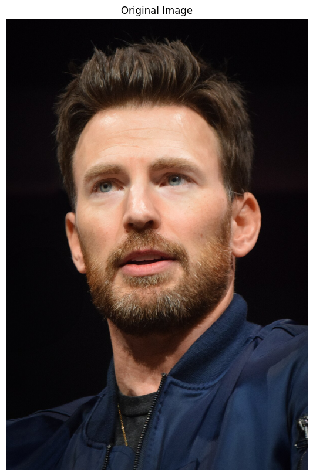
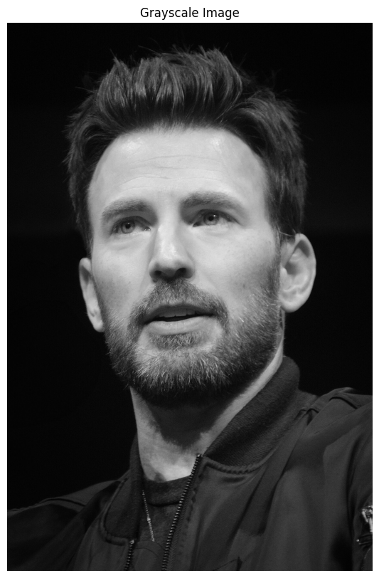
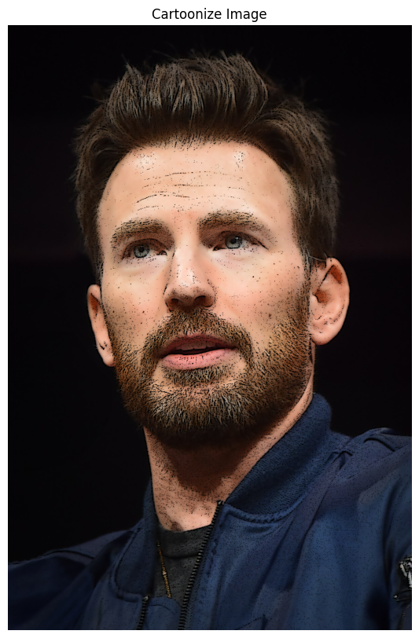

# Creative Image Filters & Effects

This project demonstrates various image effects implemented using the OpenCV library in Python. Each effect is applied to a sample image, showcasing the transformation capabilities of OpenCV.

## Prerequisites

- Python 3
- OpenCV
- NumPy
- Matplotlib

## Filters & Effects

1. **Original**
   

2. **Grayscale Effect**
   

3. **Cartoonize Effect**
   

4. **Blurred Effect**
   

5. **Sharpened Effect**
   

6. **Edge Detection**
   

7. **Inverted Colors**
   

8. **Pixelated Effect**
   

9. **Thermal Vision Effect**
   

10. **Vintage Effect**
   

11. **Watercolor Effect**
    

12. **Cinematic Effect**
    

13. **Pencil Sketch Effect**
    

14. **Lomo Effect**
    

15. **Rainbow Effect**
    

