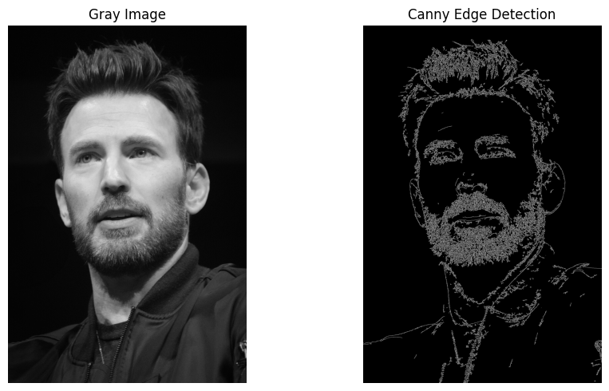
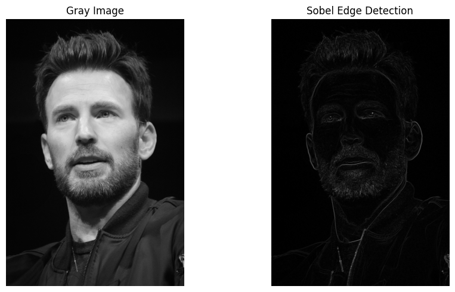
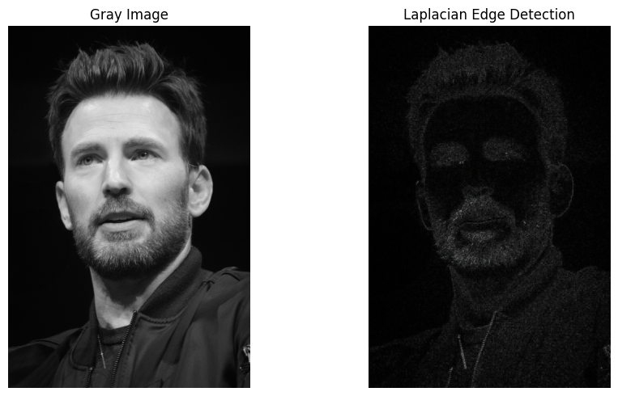
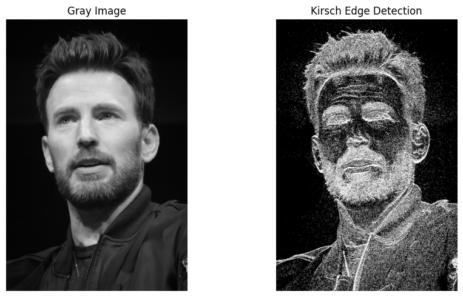
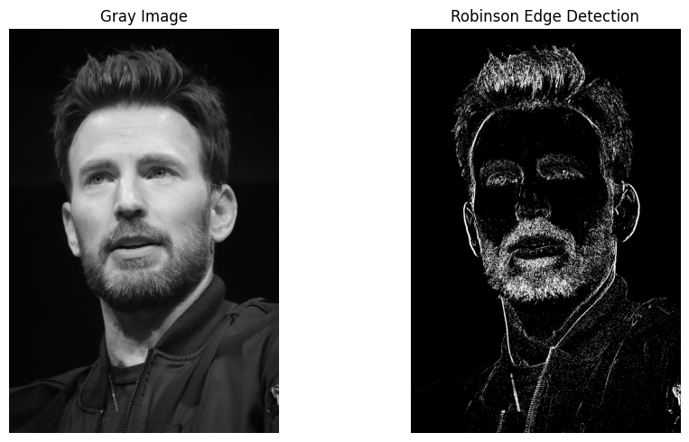
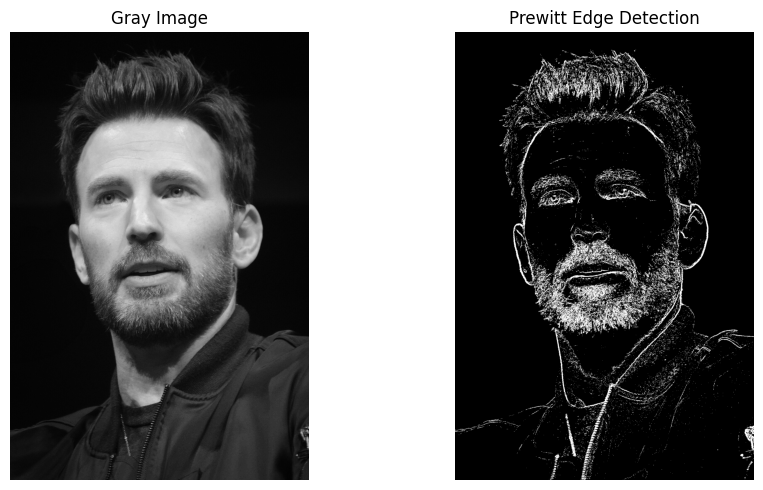
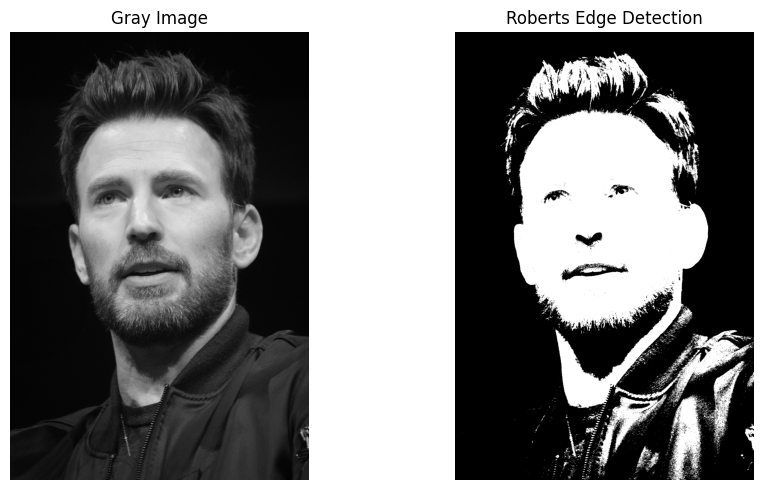
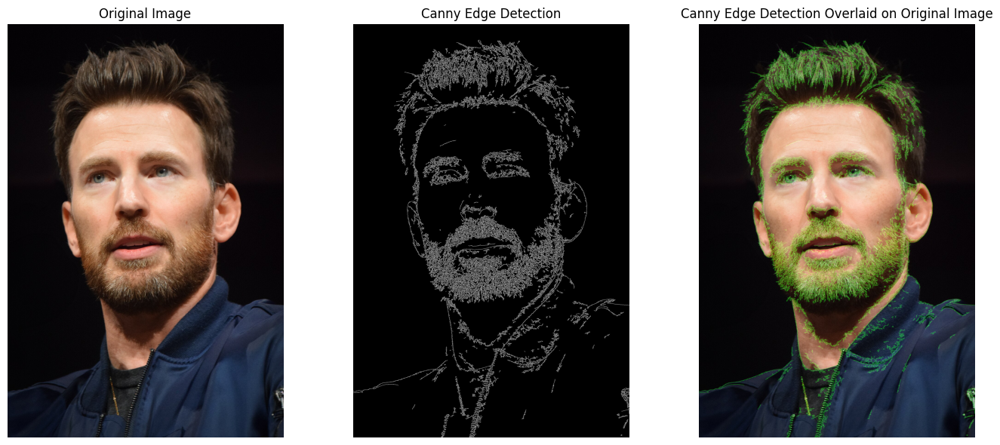

# Image Edge Detection

This project explores various edge detection techniques on images using the OpenCV library in Python. Edge detection is a fundamental image processing task that involves identifying boundaries within an image.

## Prerequisites

- Python 3
- OpenCV
- NumPy
- Matplotlib

## Edge Detection Techniques
1. **Canny Edge Detection**:
  Utilizes the Canny algorithm to identify edges in the image.

3. **Sobel Edge Detection**:
  Applies the Sobel operator to find edges based on gradient magnitude.

3. **Laplacian Edge Detection**:
  Applies the Laplacian operator to highlight rapid intensity changes.

4. **Kirsch Edge Detection**:
  Uses the Kirsch mask for edge detection.

5. **Robinson Edge Detection**:
  Applies the Robinson mask for edge detection.

6. **Prewitt Edge Detection**:
  Uses the Prewitt operator for edge detection.

7. **Roberts Edge Detection**:
  Applies the Roberts cross operator for edge detection.

8. **Canny Edge Overlay**:
  Overlays the Canny edge detection results on the original image.

## Results

1. **Original**

   
   

2. **Canny Edge Detection**

   
   

3. **Sobel Edge Detection**

   
   

4. **Laplacian Edge Detection**

   
   

5. **Kirsch Edge Detection**

   
   

6. **Robinson Edge Detection**

    
   

7. **Prewitt Edge Detection**

    
   

8. **Roberts Edge Detection**

    
   

9. **Canny Edge Overlay**

    
   
