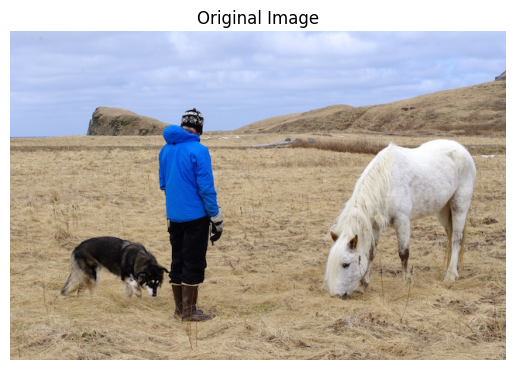
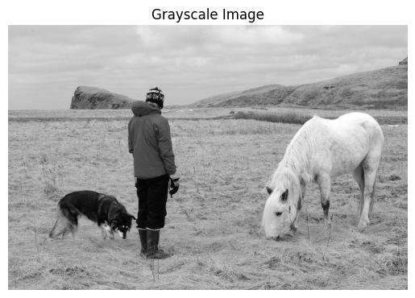
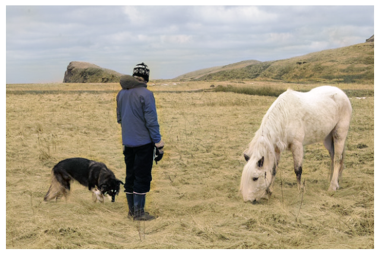

# Image Colorization

## Overview
This project is a colorization tool that utilizes deep learning to add color to grayscale images. The code includes a pipeline for processing and transforming images, as well as utilizing a pre-trained model for colorization. The colorization can be performed on either CPU or GPU, depending on the availability of GPU resources.

## Prerequisites
- Python
- OpenCV
- Matplotlib
- deoldify

## Results

1. **Original**

   
   

2. **Grayscale Image**

   
   

1. **Colorized Image from Grayscale Image**

   
   

