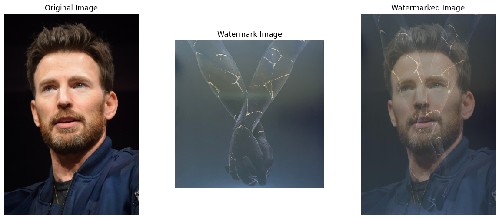

# Image Watermarking Tool

This is a simple Python code for adding a watermark to an image. The code uses the popular PIL (Pillow) library for image processing.

## Prerequisites

- python
- pillow
- matplotlib

## Features
- **Image Loading and Display**: The function can load and display input images and watermark images using the load_and_display_image function.

- **Watermarking**: The add_image_watermark function overlays a watermark onto an input image with adjustable transparency.

- **Visualization**: The code includes a visualization of the original image, watermark image, and the watermarked image using matplotlib.

## Example

1. **Example Image**

   
   

## Parameters

- **transparency**: Transparency level of the watermark (0.0 to 1.0). You can modify the transparency variable in the script to achieve the desired effect.
