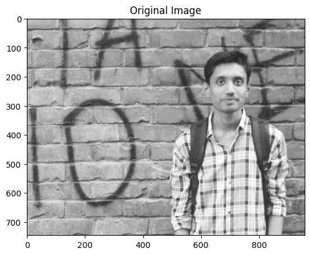
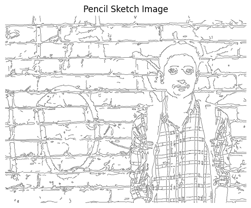

# Image to Pencil Sketch

A simple Python code to convert an image into a pencil sketch using OpenCV.

## Overview

This project utilizes the OpenCV library to perform various image processing techniques, resulting in a final pencil sketch effect. The code follows these steps:

1. Load the original image.
2. Convert the image to grayscale.
3. Apply Gaussian blur to the grayscale image for a soft effect.
4. Detect edges using the Canny edge detection algorithm.
5. Invert the edges to create a white sketch on a black background.
6. Save the final sketch image and display it.

## Example

1. **Original Image**

   
   

2. **Pencil Sketch Image**

   
   

